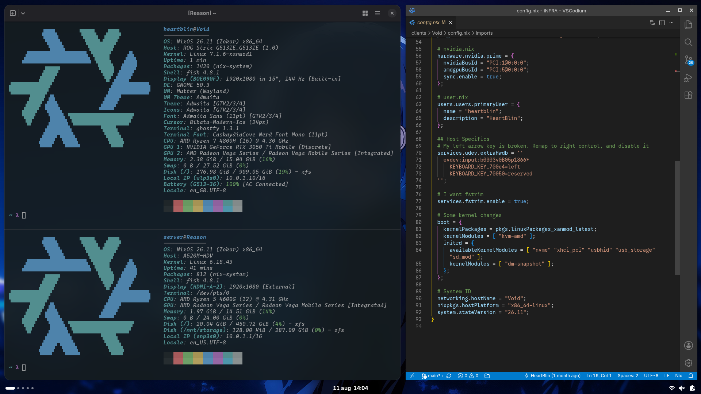

# iNFRA

##### _Perpetually beta btw_

This is my repo for keeping my NixOS flake in. You should not try to install any of the systems defined here. Nothing in this repo is final, I break things often. Commits are sometimes spurious, bulky or lack good messages. The only thing I'm sure of is that the packages exported would work, however they may or may not get removed at any point. This is to say, look at the nix code, stealing things is encouraged, but don't try to run this.

Even so, YMMV with what's here.

#### Dual-licensed under [MIT](LICENSE) or the [UNLICENSE](UNLICENSE).

### Desktop

It's just lightly modified GNOME.

### Hosts

| Host | Type | CPU / SOC | RAM | GPU | Storage | Motherboard / Device name|
|---|---|---|---|---|---|---|
| [`Origin`](/clients/Origin/config.nix) | ISO _ins_ | - | - | - | - | - |
| [`Reason`](/clients/Reason/config.nix) | Server | AMD Ryzen 5 4600G | 16 GB DDR4-2666 | Radeon Vega | [512 GB NVMe](/clients/Reason/disko.nix) (XFS) + 512 GB SATA (ZFS) | A520M-HDV |
| [`Void`](/clients/Void/config.nix) | Laptop | AMD Ryzen 7 4800H | 16 GB DDR4-3200 | RTX 3050 Ti | [1 TB NVMe](/clients/Void/disko.nix) (XFS) | ROG Strix G513IE |
| [`Thunder`](https://www.gsmarena.com/google_pixel_9a-13478.php) | Phone | Google Tensor G4 | 8 GB LPDDR5X | Mali-G715 | 128 GB (f2fs) | Pixel 9a |
| [`Wind`](https://www.gsmarena.com/samsung_galaxy_tab_s9_fe-12517.php) | Tablet | Exynos 1380 | 8GB LPDDR4X | Mali-G68 MP5 | 128 GB (f2fs) | Galaxy Tab S9 FE |
| [`Ice`](https://www.gsmarena.com/samsung_galaxy_watch5-11748.php) | Watch | Exynos W920 | 1.5GB LPDDR4 | Mali-G68 | 16 GB (f2fs) | Galaxy Watch5 |
| [`Death`](https://www.ovhcloud.com/en/) | S3 | - | - | - | - | - |
| [`Finality`](/clients/Finality/config.nix) | ISO _CA_ | - | - | - | - | - |

### Credits

Configurations where I got *inspired* from:
[TheMaxMur](https://github.com/TheMaxMur/NixOS-Configuration) |
[fufexan](https://github.com/fufexan/dotfiles) |
[rxyhn](https://github.com/rxyhn/yuki) |
[NotAShelf](https://github.com/NotAShelf/nyx) _archived_

Thanks! **^\_\_^**
