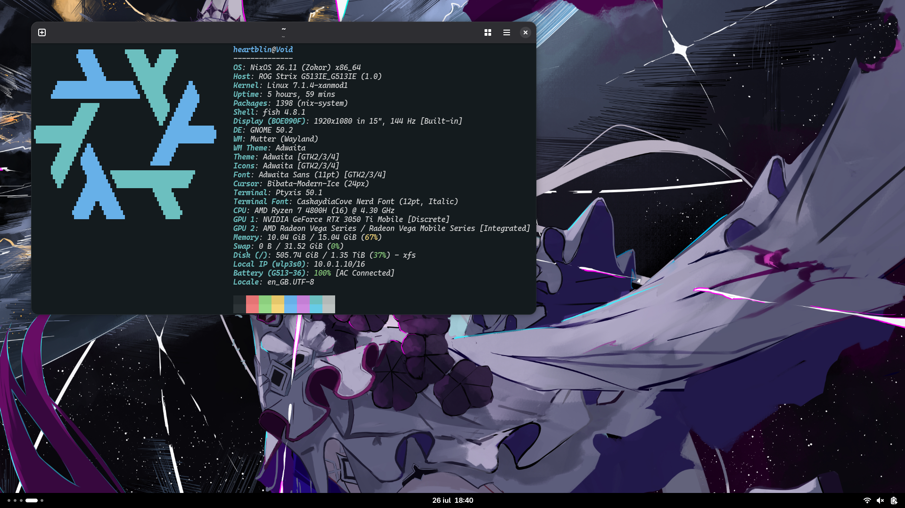

<h1 align="center"> Infra </h1>
<h5 align="center"> Perpetually beta btw </h5>

<h2> About </h2>

> [!CAUTION]
>
> You should not try to install any of the systems defined here. Nothing in this repo is final, I break things often. Commits are sometimes spurious, bulky or lack good messages.
>
> The only thing I'm sure of is that the packages exported would work, however they may or may not get removed at any point.
>
> This is to say, look at the nix code, stealing things is encouraged, but don't try to run this.
>
> Even so, YMMV with what's here.

<h2> Hosts </h2>

<table align="center">

**[`Void`](/clients/Void/config.nix)** - Laptop

| Key | Value |
|---|---|
| Motherboard | ROG Strix G513IE |
| CPU | AMD Ryzen 7 4800H |
| RAM | 16GB DDR4-3200 |
| GPU | NVIDIA GeForce RTX 3050 Ti |
| Storage | [1TB NVME + 512GB NVME](/clients/Void/disko.nix) |

</td>
</tr>
</table>

<h2>Desktop</h2>

<h2> Credits </h2>

Configurations where I got *inspired* from:
[TheMaxMur](https://github.com/TheMaxMur/NixOS-Configuration) |
[fufexan](https://github.com/fufexan/dotfiles) |
[rxyhn](https://github.com/rxyhn/yuki) |
[NotAShelf](https://github.com/NotAShelf/nyx) _archived_

Thanks! **^\_\_^**

<h2> License </h2>

This repo mainly follows the [Unlicense](https://unlicense.org/). The [MIT License](https://opensource.org/licenses/MIT) is an alternative that can be choosen to be followed instead.
